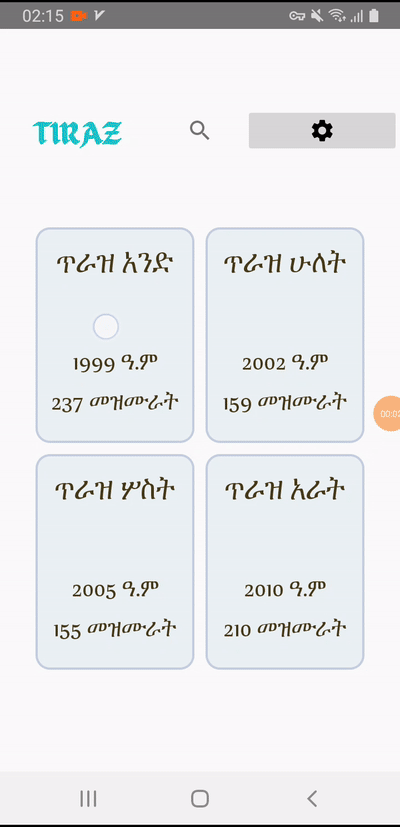

# ጥራዝ 

በማኅበረ ቅዱሳን የተዘጋጁትን አራት ጥራዞች የመዝሙር ግጥሞች ከድምጽ ቅጅ ጋር የያዘ የአንድሮይድ መተግበሪያ። 

# ይዘት 

<ul>
<li> በአራቱ ጥራዞች የሚገኙትን የሁሉንም መዝሙራት ግጥሞች፤ 
<li> በአራቱ ጥራዞች የሚገኙትን የአብዛኞቹን መዝሙራት የድምጽ ቅጂ ከበይነ መረብ በማውረድ ያጫውታል፤
</ul>

# Demo

